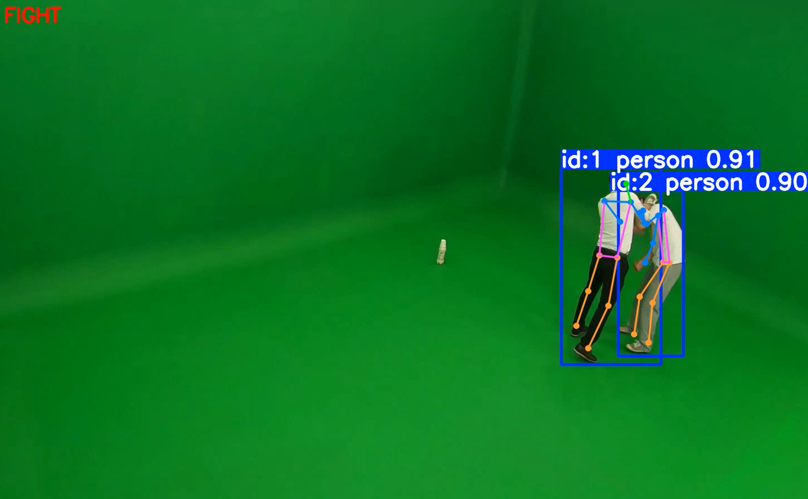

# Violence-Detect-YOLO

### reference
Yolo pose + MLP(3layer)
https://github.com/erwinyo/Fight-Detection-Yolov8-Pose

## Two methods of violence detection
### 1. MLP
Yolo v8x-pose + MLP  


### 2. LSTM
Yolo v8x-pose + LSTM  



## Environment setting
### 1. Env set
```
conda create -n violence python=3.10 -y
conda activate violence
pip install -r requirements.txt
```
You must need to check version of numpy and opencv
### 2. Feature set(if you have your data)
```
python pose_feature.py
```
Then you will have data for model training and evaluation.

## How to use fight detect MLP
### 1. Train and Eval MLP
```
python mlp/mlp_train.py
python mlp/mlp_eval.py
```
### 2. Inference
```
python mlp/mlp_infer.py
```

## How to use fight detect lstm
### 1. Train and Eval LSTM
```
python mlp/lstm_train.py
python mlp/lstm_eval.py
```
### 2. Inference
```
python mlp/lstm_infer.py
```